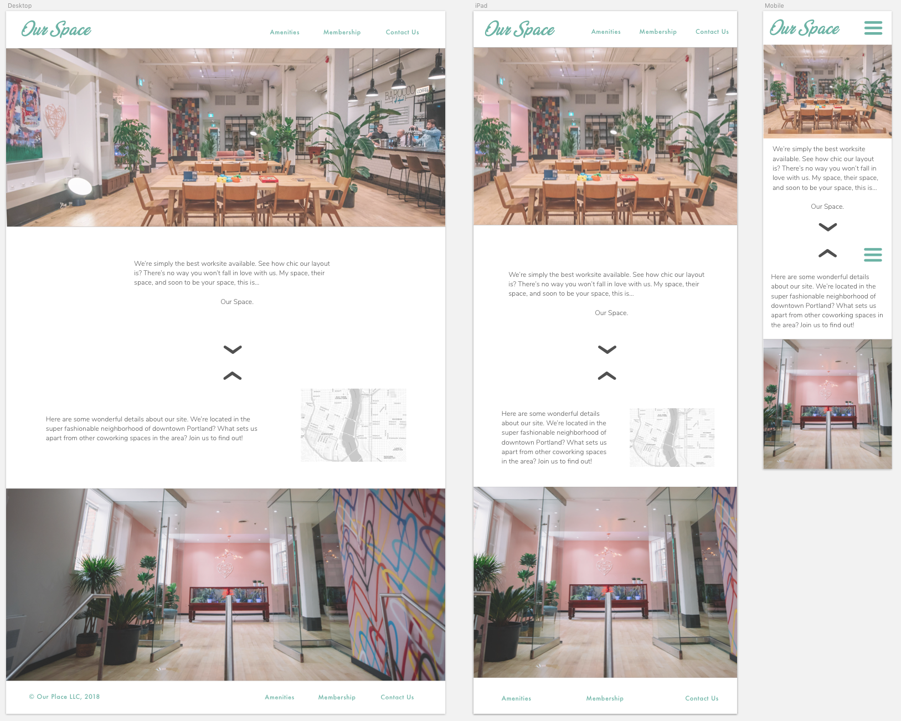
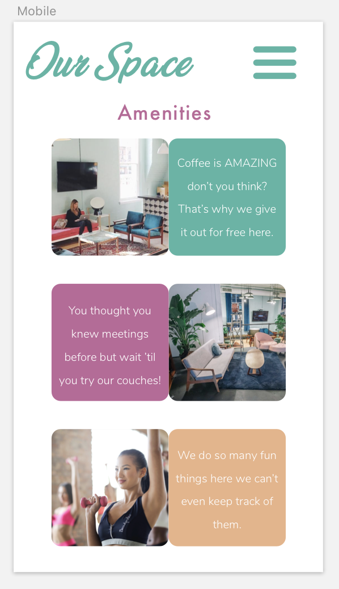
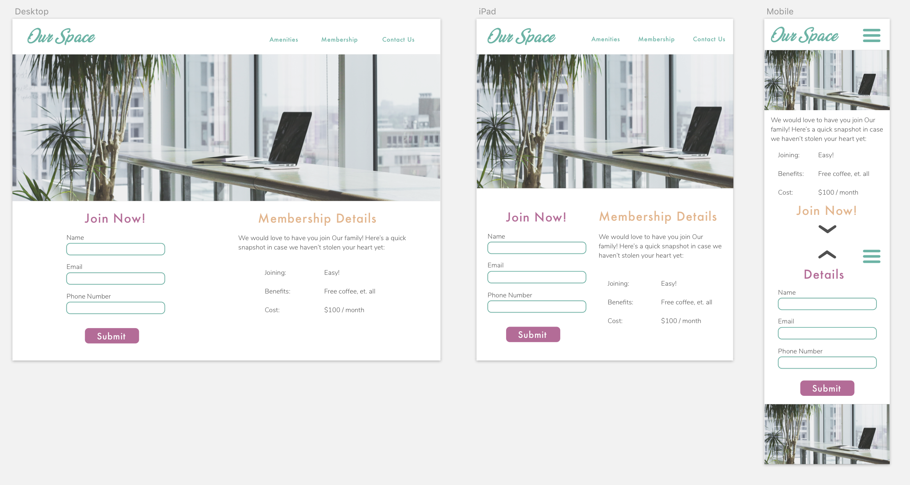
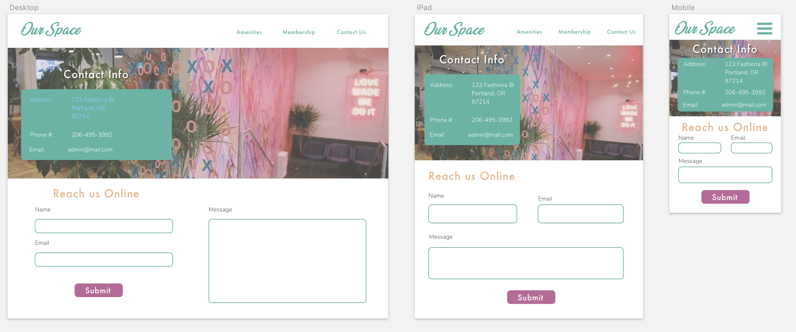

# _Coworking Site Pitch_

#### _A start to finish site development for a theoretical coworking client, September 21 2018_

#### By _**Luke Vandekieft**_

## Description

_This project is an exercise in developing a website based on a theoretical client request. The full-cycle workflow will go as follows:_
* _Identify target users & their stories_
* _Research design ideas & layouts based on the target users and client requests_
* _Hand-draw pages to decide on page layouts_
* _Turn drawn layouts into a hi-fi site mockup_
* _Turn said mockup into a functioning prototype_
* _Create webpage that accurately reflects the prototype_

_By engaging in this exercise I hope to practice & demonstrate my ability to fulfill a client request in a professional & efficient manner. If you have any suggestions or comments I would love to hear! Feel free to contact me at vandekie@gmail.com._

## Target Users

_Our client's business is a new, luxurious-yet-open coworking space with an open feel and various amenities. Based on this information I've created user personas for some target users:_

##### &nbsp;&nbsp;&nbsp;&nbsp;Carrie Shawbrad
_&nbsp;&nbsp;&nbsp;&nbsp;Seasoned freelancer too social to work from home._
* _Needs:_
  * _Easy ways to contact staff_
  * _Up-to-date list of activities, amenities, coffee menu, etc._
* _Pain Points:_
  * _Unprofessional/unappealing layout_
* _Solutions:_
  * _Keep site well-updated_
  * _Make information easy to access_
  * _Use appealing website branding_

##### &nbsp;&nbsp;&nbsp;&nbsp;Zach Muckerberg
_&nbsp;&nbsp;&nbsp;&nbsp;Start-up creator who needs a workspace for his small team._
* _Needs:_
  * _Consistent group workspace access (ideally a room reservation system)_
  * _Personal relationship with client staff (clear contact info)_
* _Pain Points:_
  * _Lack of clear workspace separation_
  * _Disorganized information & communication_
* _Solutions:_
  * _Make contact hours/numbers/etc. easy to find_
  * _Update room reservations online, or at least mention their existence in amenities section_

##### &nbsp;&nbsp;&nbsp;&nbsp;Lucas Vandenbos
_&nbsp;&nbsp;&nbsp;&nbsp;Remote employee who struggles working from home._
* _Needs:_
  * _Minimal - a place to do their own thing in peace and comfort_
* _Pain Points:_
  * _High prices_
  * _Too much noise/socialization_
* _Solutions:_
  * _Clearly identify pricing & amenities to advertise_
  * _Use website branding that isn't too intimidating or exclusive_

##### &nbsp;&nbsp;&nbsp;&nbsp;Jane Smith
_&nbsp;&nbsp;&nbsp;&nbsp;MLM employee who wants a safe & inviting place to call work._
* _Needs:_
  * _Comfortable website and business_
  * _Well-defined amenities to keep user interested in site & business_
* _Pain Points:_
  * _Unclear target demographic - is this for me?_
  * _Lack of information - what am I getting into?_
* _Solutions:_
  * _Use appealing images/design/etc. that feel accessible._

## User Stories

* _As a prospective customer, I want the site to clearly show what the business space looks like._
* _As a prospective customer, I want to know about amenities, pricing, and other reasons to join._
* _As a customer, I want an up-to-date list of amenities such as activity schedules, coffee flavors, and so forth._
* _As a customer, I want an easy way to contact staff._
* _As a manager, I want an easy way to update information on the site._
* _As an owner, I want the website aesthetic to accurately reflect my company's branding._

## Design Decisions
_The client's design requests can be summarized as:_
* _Minimum 4 pages: homepage, contact, membership detail, and detailed amenities page._
* _Luxurious, cool aesthetic that still feels 100% accessible._
* _Funky, fun, & local feel that separates them from competitors._
* _Open design that doesn't pigeonhole us with tech workers._
* _Incorporate physical space in online design: space is bright, open, pastel-colored, and modern-feeling. Plants and light woods are abundant and a recurring heart/love theme is used subtlely._

_Based on these I've decided to go with a modern, image-heavy site that uses pop/pastel colors in a tasteful manner._

_Upscale restaurants & housing sites tend to be very image-heavy as this is what ultimately sells the product. They tend to have minimalist menus at the top that keep the site functional without detracting from the overall feel. Examples include the Aman hotel site, Tusk restaurant, and The Honours restaurant (sans excessive animations)._

_I decided to go with a pastel, modern, and vaguely retro feel for the design as this felt both appropriate for the business and distinctive. The client's competitors take a minimalist design approach but a colorful look is more unique and welcoming. This classy pastel color scheme is something I've seen work successfully in Mackinac Island's Grand Hotel (not the website!), Portland's Tusk restaurant, and various makeup ad campaigns. In particular I found Portland's Tusk website to be inspiring as it looks very fun & inviting while still conveying the image of luxury - it's simply luxury that isn't exclusive. The art style will be distinctly NOT techy and convey a funkier Portland flavor that makes it appeal to Portlanders of all sorts._

_This design should meet prospective customer needs by presenting instant visual appeal while still providing useful information. The menu will be clear & navigable enough that the visuals won't be too distracting for returning users & admins simply trying to get the site work. The majority of our prospective users will be tech-savvy enough to understand basic web navigation as most contractors/freelancers/remote workers/creatives looking for a shared urban space will already use the internet for some part of business._

## Drawn Page Outlines

## Wireframes

## Setup/Installation Requirements

_Live site is at https://coworking-site.firebaseapp.com/_
 
 

_To download & edit do the following:_

* _Get file from Github._

      $ git clone https://github.com/lukevandekieft/coworking-site.git

* _Install NPM (node package manager) as needed - instructions can be found at https://www.npmjs.com/get-npm ._

* _Install necessary webpack dependencies for project._

      $ npm install

* _Compile and open webpage in developer mode._

      $ npm run start

## Technologies Used

* _HTML_
* _CSS_
* _Sass preprocessor_
* _Webpack_
* _JavaScript_

## Support and contact details

_If you have any suggestions or comments please forward them to Luke Vandekieft at vandekie@gmail.com_

## License

*This software is licensed under the MIT License.*

Copyright (c) 2018 **_Luke Vandekieft_**
